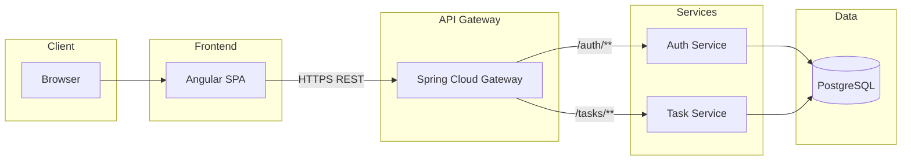

# Smart Task App

A microservices-style task management system. Users register and sign in through an **Auth** service (JWT), manage tasks through a **Task** service, and access everything from an **Angular** SPA. All API traffic can go through a **Spring Cloud Gateway** with JWT validation, backed by **PostgreSQL**.

---

## Architecture

Clients talk only to the **API Gateway**. The gateway validates JWTs for protected routes, forwards `/auth/**` to the auth service and `/tasks/**` to the task service, and applies CORS for the Angular app.



**Request flow (simplified)**

1. User opens the Angular app and calls `/auth/register` or `/auth/login` via the gateway.
2. Auth service issues a JWT; the SPA stores it and sends `Authorization: Bearer <token>` on subsequent calls.
3. For `/tasks/**`, the gateway validates the JWT, then proxies to the task service.

---

## Technologies

| Area | Stack |
|------|--------|
| **API Gateway** | Spring Boot 3, Spring Cloud Gateway, WebFlux, Spring Security, JWT (JJWT) |
| **Auth service** | Spring Boot 3, Spring Web, Spring Data JPA, PostgreSQL, Spring Security, Lombok |
| **Task service** | Spring Boot 3, Spring Web, Spring Data JPA, PostgreSQL, Lombok, Springdoc OpenAPI |
| **Frontend** | Angular 18, TypeScript, RxJS, SCSS |
| **Data** | PostgreSQL 16 |
| **Containers** | Docker, Docker Compose |
| **Build** | Maven (Java 17), npm |

---

## Prerequisites

- **Docker Desktop** (or Docker Engine + Compose plugin), **or**
- **Local dev:** JDK 17, Maven 3.9+, Node.js 20+ and npm, PostgreSQL 16+

---

## How to run

### Option A: Docker Compose (recommended)

From the repository root:

1. **Start the stack**

   ```bash
   docker compose up --build
   ```

2. **Wait** until Postgres is healthy and Spring services have started (first run can take several minutes while images build).

3. **Open the app**

   | What | URL |
   |------|-----|
   | Angular UI | [http://localhost:4200](http://localhost:4200) |
   | API Gateway | [http://localhost:8080](http://localhost:8080) |
   | Auth service (direct) | [http://localhost:8081](http://localhost:8081) |
   | Task service (direct) | [http://localhost:8082](http://localhost:8082) |
   | PostgreSQL | `localhost:5432` (user/password `postgres` by default) |

4. **Typical flow**

   - Register a user, then log in.
   - Open **Tasks** (or navigate after login). Create, complete, and delete tasks through the UI.

5. **Stop**

   ```bash
   docker compose down
   ```

   To remove the database volume as well:

   ```bash
   docker compose down -v
   ```

**Environment (optional)**  
Create a `.env` file in the project root to override defaults, for example:

```env
POSTGRES_USER=postgres
POSTGRES_PASSWORD=postgres
CORS_ALLOWED_ORIGIN=http://localhost:4200
JWT_SECRET=your-shared-secret
```

The gateway and auth service must use the **same** JWT secret for tokens to validate.

---

### Option B: Local development (without Docker for apps)

1. **PostgreSQL** — Create databases `auth_db` and `taskdb` (and user/password matching `application.properties` in each service).

2. **Auth service**

   ```bash
   cd auth-service
   mvn spring-boot:run
   ```

   Default port: **8081**.

3. **Task service**

   ```bash
   cd task-service
   mvn spring-boot:run
   ```

   Default port: **8082**.

4. **API gateway** — Point routes at `localhost:8081` and `localhost:8082` (default in `application.yml`), then:

   ```bash
   cd api-gateway
   mvn spring-boot:run
   ```

   Default port: **8080**.

5. **Angular**

   ```bash
   cd smart-task-frontend
   npm install
   npm start
   ```

   Dev server: **http://localhost:4200** (ensure `src/environments/environment.ts` has `apiUrl: 'http://localhost:8080'`).

---

## Screenshots

Add screenshots here to document the product for contributors and stakeholders.

| Screenshot | Suggested capture |
|------------|-------------------|
| Login | Login page with username/password |
| Register | Registration form |
| Task list | Task list with create form, checkboxes, and delete |
| API / Swagger | Optional: Swagger UI for task-service or gateway health |

**Suggested layout**

1. Create a folder: `docs/screenshots/`
2. Save images as PNG or WebP (e.g. `login.png`, `tasks.png`).
3. Reference them in this section, for example:

   ```markdown
   
   
   ```

Replace the lines above with real paths after you add the files.

---

## Repository layout

| Path | Description |
|------|-------------|
| `api-gateway/` | Spring Cloud Gateway, JWT filter, routing |
| `auth-service/` | Registration, login, JWT issuance |
| `task-service/` | Task CRUD and updates |
| `smart-task-frontend/` | Angular SPA |
| `docker-compose.yml` | Postgres + services + frontend |
| `docker/postgres/` | Database init scripts |

---

## License

Specify your license here (e.g. MIT, Apache 2.0, or proprietary).
